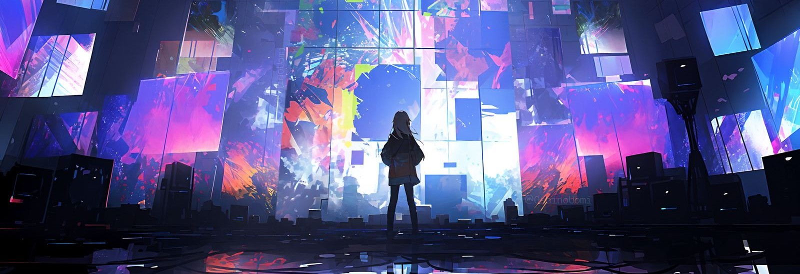

  

<table>
   <tr>
    <td colspan="2">

<h3 align="center">The UNIVERSE I'm IMAGINING &nbsp; \(⁠╹⁠▽⁠╹⁠⁠)/ </h3>

  </tr>

<td valign="top" width="62%">

I'm a **developer, AI systems research engineer, polymath, and an unapologetic STEM nerd**. I like understanding things from the model down to the machine, and I enjoy moving between different areas of computing and science.

My main focus is **AI systems**, especially LLMs, world models, generative & diffusion models, multimodal learning, reasoning, agentic systems and GPU computing.

I'm also interested in **robotics, low-level systems, hardware-software co-design, neuroscience, AR/VR, graphics, animation, creative coding, artificial life, algorithms, competitive programming, and mathematics** ... honestly, the list is endless. I'm interested in almost everything, and sooner or later I usually want to learn it, build something with it, or both.

I experiment a lot. I build things, test ideas, go down rabbit holes, and sometimes end up somewhere completely different from where I started.
Mostly, I just love learning about things and making something with them.

</td>
<td align="center" valign="middle">

</td>
</tr>
</table>

Thanks for stopping by

Feel free to look around, explore the projects, and wander through the things I've been building and experimenting with. Some of them are listed below, and there are plenty of side quests hidden around here too.

## Projects
### Systems & Low-Level

- [**Hypertracer**](https://github.com/whoashish115/hypertracer) - From-scratch ray tracer in C++ with CUDA GPU acceleration and physically based rendering.
- [**Wintergreen**](https://github.com/whoashish115/wintergreen) - Vector search library with Flat, IVF, HNSW, Product Quantization, and K-Means indexes in C++.
- [**Autiepie**](https://github.com/whoashish115/autiepie) - Regex engine in C++ using Thompson's NFA construction for backtracking-free linear-time matching.
- [**Uwun**](https://github.com/whoashish115/uwun) - Lightweight cross-platform VPN tunneling IP traffic over mutual TLS using OpenSSL in modern C++.

### AI & Computer Vision

- [**Object Detection Using YOLO**](https://github.com/whoashish115/object-detection-using-yolo) - Real-time object detection demo with YOLOv3-tiny and OpenCV DNN.
- [**Virtual Assistant**](https://github.com/whoashish115/virtual-assistant) - AI desktop assistant with voice chat, system monitoring, automation, and GPT-powered conversations.

### Web Development

#### Full-Stack Apps

- [**Wonder Hive**](https://github.com/whoashish115/wonder-hive) - Full-stack social media platform with Next.js, Express, MongoDB, Socket.IO, and real-time chat.
- [**Niko Waves**](https://github.com/whoashish115/niko-waves) - Anime streaming and discovery platform with Next.js, React, Bun, Hono, and Firebase.
- [**Blocky Net**](https://github.com/whoashish115/blocky-net) - Full-stack blogging platform with a CMS, analytics, and integrated crypto market data.
- [**Aether Nest**](https://github.com/whoashish115/aether-nest) - Visual content platform for Flashes, Boards, and social features built on the MERN stack.
- [**Nova Social**](https://github.com/whoashish115/nova-social) - Full-stack social platform with real-time chat, calls, stories, and customizable themes.

#### Frontend & APIs

- [**Nyron Ring**](https://github.com/whoashish115/nyron-ring) - Open-source webring template with a member directory, tag search, combined RSS blog, and an embeddable ring widget.
- [**Retro Palace**](https://github.com/whoashish115/retro-palace) - Retro 88×31 button maker with a layer-based editor, animations, and GIF export.
- [**Vox Cell**](https://github.com/whoashish115/vox-cell) - Browser-based pixel art studio with layers, palettes, drawing tools, and filters.
- [**Bit Space**](https://github.com/whoashish115/bit-space) - Browser-based ASCII art studio with image-to-ASCII conversion, FIGlet text, and rich exports.
- [**Solid Explore**](https://github.com/whoashish115/solid-explore) - Advanced search query builder with file-type filters, operators, and multi-engine support.
- [**Baka Pager**](https://github.com/whoashish115/baka-pager) - Desktop web app to paginate through any GitHub user's followers/following via GraphQL.
- [**Neuro Vance**](https://github.com/whoashish115/neuro-vance) - Modern tech company landing page with smooth animations and responsive design.
- [**Luxe Artifacts**](https://github.com/whoashish115/luxe-artifacts) - Web3-inspired landing page with immersive animations and a futuristic interface.
- [**Giggle Charisma**](https://github.com/whoashish115/giggle-charisma) - Meme generator with drag-and-drop editing, popular templates, and image downloads.
- [**Terminal Portfolio**](https://github.com/whoashish115/terminal-portfolio) - Terminal-style portfolio template with interactive CLI, ASCII art, and theme switching.
- [**Med Experts**](https://github.com/whoashish115/med-experts) - Medical and physiotherapy landing page template with appointment booking and dark mode.

### Creative Coding & Algorithmic Art

- [**Sacred Geometry**](https://github.com/whoashish115/sacred-geometry) - Meditative exploration of infinite geometric patterns and overlapping symmetry through code.
- [**Hypercube Visualization**](https://github.com/whoashish115/hypercube-visualization) - Real-time projection of n-dimensional hypercubes into 3D space using CUDA and OpenGL.
- [**Procedural Map Generation**](https://github.com/whoashish115/procedural-map-generation) - Procedural tile map generator driven by local pattern constraints.
- [**Procedural Dungeon Generation**](https://github.com/whoashish115/procedural-dungeon-generation) - Interactive dungeon generator using constraint-based pattern synthesis in p5.js.
- [**Sketches**](https://github.com/whoashish115/sketches) - A collection of generative algorithmic sketches exploring simple rules and randomness.
- [**Space Colonization Algorithm**](https://github.com/whoashish115/space-colonization-algorithm) - Fast procedural generation of 2D/3D branching structures using CUDA.

### ALife

- [**Conway's Game of Life**](https://github.com/whoashish115/conway-game-of-life) - Exploration of cellular automata, emergent behaviors, and various life-like rules.

### Game Development

- [**Cube Cracker**](https://github.com/whoashish115/cube-cracker) - Interactive 3D Rubik's Cube simulator with Pygame, OpenGL, camera controls, and solve playback.
- [**Void Break**](https://github.com/whoashish115/void-break) - Neon brick-breaker arcade game with 100 procedural levels, power-ups, and enemy bricks.
- [**Space Shooter**](https://github.com/whoashish115/space-shooter) - 2D space shooter with scrolling backgrounds, asteroid battles, a boss fight, and sound effects.
- [**Cyber Swarm Escape**](https://github.com/whoashish115/cyber-swarm-escape) - Fast-paced 2D arcade survival game built with Pygame.
- [**Snake Game**](https://github.com/whoashish115/snake-game) - Modern Snake game with PyQt6 featuring AI opponents and multiple difficulty levels.

### Algorithms & Puzzles

- [**Maze Flux**](https://github.com/whoashish115/maze-flux) - Maze editor and A* pathfinding visualizer with animated algorithm playback in PyQt6.
- [**Sudoku Solver**](https://github.com/whoashish115/sudoku-solver) - Desktop Sudoku app with recursive backtracking solver and real-time visualization.

### Bioinformatics

- [**Gene Archive**](https://github.com/whoashish115/gene-archive) - CLI DNA data storage simulator that encodes files into DNA sequences with parity-based recovery.

### Bots & Automation

- [**Solistra Bot**](https://github.com/whoashish115/solistra-bot) - Telegram bot for anime/manga discovery with search, watchlists, and image recognition via Jikan API.
- [**Auralis Bot**](https://github.com/whoashish115/auralis-bot) - Discord bot for fetching the latest news with keyword/category search using NewsData API.
- [**GitHub Avatar Crawler**](https://github.com/whoashish115/github-avatar-crawler) - CLI tool to crawl GitHub followers/following and download profile avatars.
- [**Moe Kaiketsu**](https://github.com/whoashish115/moe-kaiketsu) - Chrome/Edge extension that adds a waifu above every Codeforces problem statement.

### Miscellaneous

- [**Library Management**](https://github.com/whoashish115/library-management) - Desktop Library Management System with Python, CustomTkinter, MySQL, and automated fines.
- [**Archive Toolkit**](https://github.com/whoashish115/archive-toolkit) - Simple toolkit for archiving and backing up personal data.

### Problem Sets

- [**CSES**](https://github.com/whoashish115/cses) - Solutions to the CSES Problem Set in C++.
- [**SPOJ**](https://github.com/whoashish115/spoj) - Solutions to SPOJ Classical Problems in C++.
- [**Tensara**](https://github.com/whoashish115/tensara) - Tensara solutions while learning CUDA and GPU programming.
- [**Rosalind**](https://github.com/whoashish115/rosalind) - Solutions to Rosalind bioinformatics problems combining biology and algorithmic thinking in Rust.

